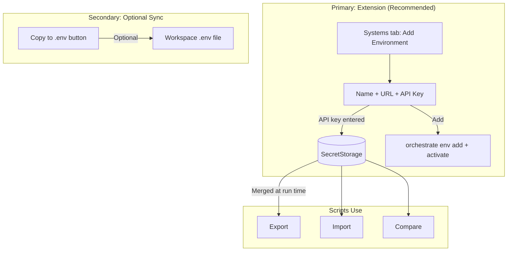
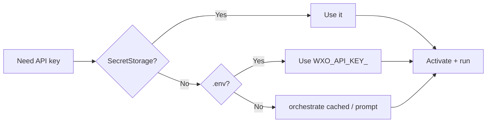
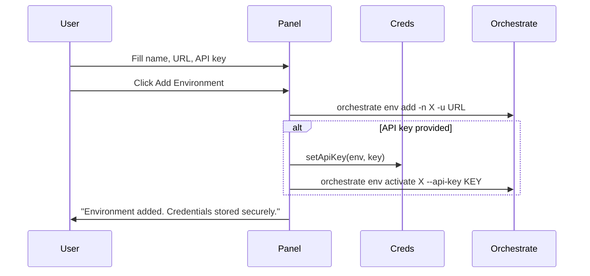
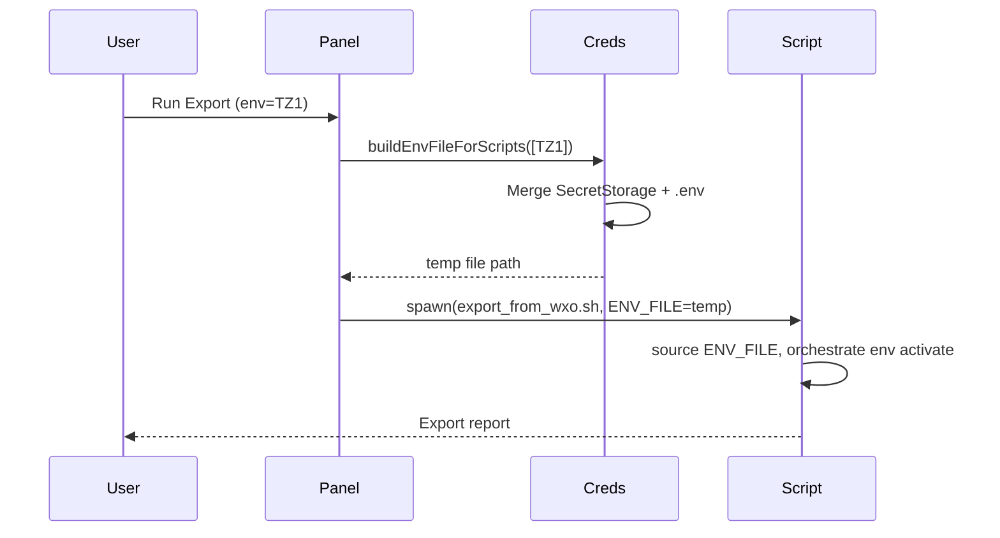

# WxO Toolkit — Setup Guide

**IBM Watsonx Orchestrate (WxO)** · VS Code Extension

This guide walks you through configuring the WxO Toolkit extension with a **single, simple flow**: configure in the extension first, then optionally copy to orchestrate or `.env`.

---

## Credentials Flow Overview

---

## Step-by-Step Setup

### 1. Install Prerequisites

- **orchestrate CLI (ADK 2.5.0+)** — `pip install --upgrade ibm-watsonx-orchestrate`
- **jq** — `brew install jq` (macOS) or `apt-get install jq` (Linux)
- **unzip** — usually preinstalled

**Python venv?** If orchestrate is in a virtual environment, set **Settings** → `orchestrateVenvPath` → `.venv` (or your venv path).

### 2. Add Your First Environment (Extension UI)

1. Open **WxO Toolkit** in the Activity Bar.
2. Click **Open Panel**.
3. Go to the **⊕ Systems** tab.
4. Fill in **Add Environment**:
   - **Name** — e.g. `TZ1`
   - **URL** — e.g. `https://api.us-south.watson-orchestrate.cloud.ibm.com/instances/...`
   - **API Key** — paste your API key (recommended; stored securely)
5. Click **+ Add Environment**.

**What happens:**
- The extension runs `orchestrate env add` and `orchestrate env activate --api-key`.
- Your API key is stored in VS Code **SecretStorage** (encrypted, not in `settings.json`).
- Export, Import, Compare, and Create Tool will use these credentials automatically.

### 3. Optional: Copy to Workspace `.env`

If you want credentials in a workspace `.env` file (e.g. for terminal use or sharing):

1. In **Systems** tab, click **📋 Copy to .env**.
2. This writes `WXO_API_KEY_<env>` for each stored environment to your workspace `.env`.

---

## Credential Resolution Order

| Priority | Source | When used |
|----------|--------|-----------|
| 1 | Extension SecretStorage | When you add env with API key in Systems tab |
| 2 | Workspace `.env` | `WXO_API_KEY_TZ1=...` |
| 3 | orchestrate CLI config | Previously activated with `orchestrate env activate` |

---

## Flow: Add Environment (Detailed)

---

## Flow: Running Export/Import (Detailed)

---

## Troubleshooting

| Issue | Solution |
|-------|----------|
| "orchestrate: command not found" | Install orchestrate CLI; if in venv, set `orchestrateVenvPath` |
| "API key required" | Add environment with API key in Systems tab, or add `WXO_API_KEY_<env>` to `.env` |
| "No environments found" | Add at least one environment in Systems tab |
| Scripts fail with missing key | Use **Copy to .env** or ensure you added the env with API key in the extension |

---

## See Also

- [USER_GUIDE.md](USER_GUIDE.md) — Full feature reference
- [README.md](README.md) — Quick start and settings
