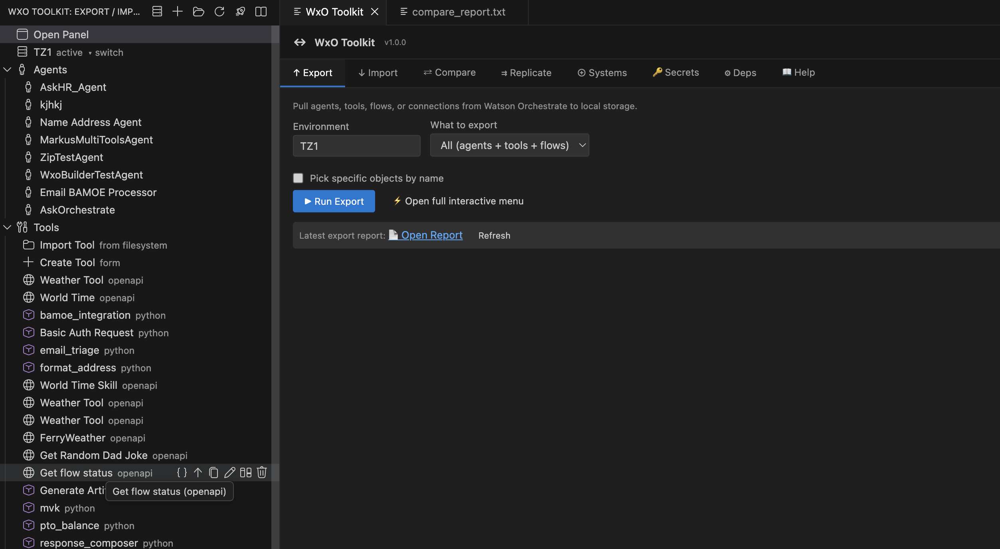
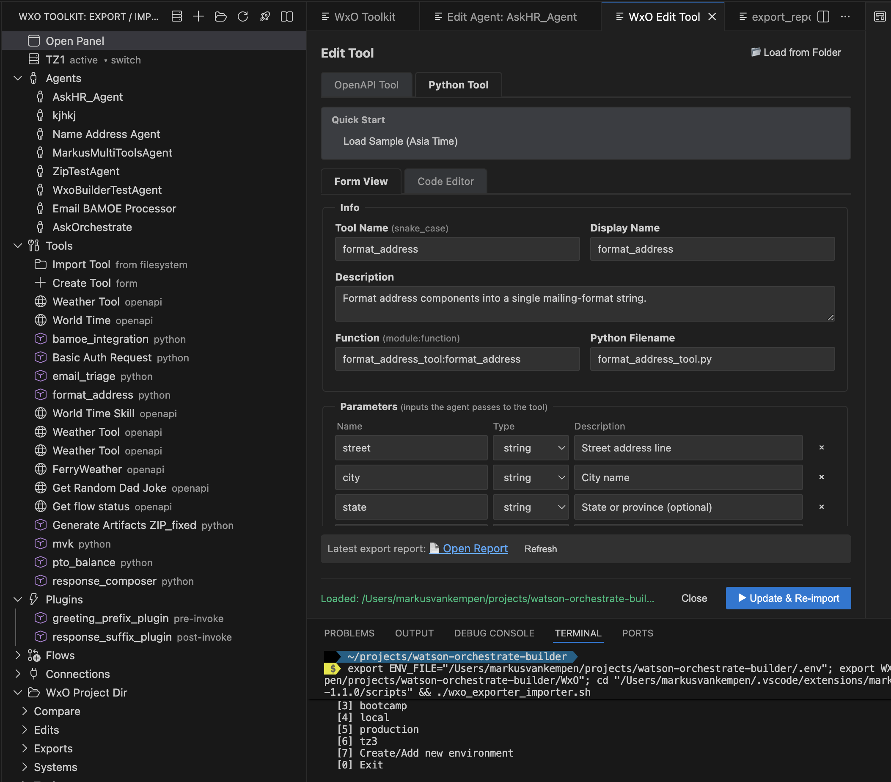
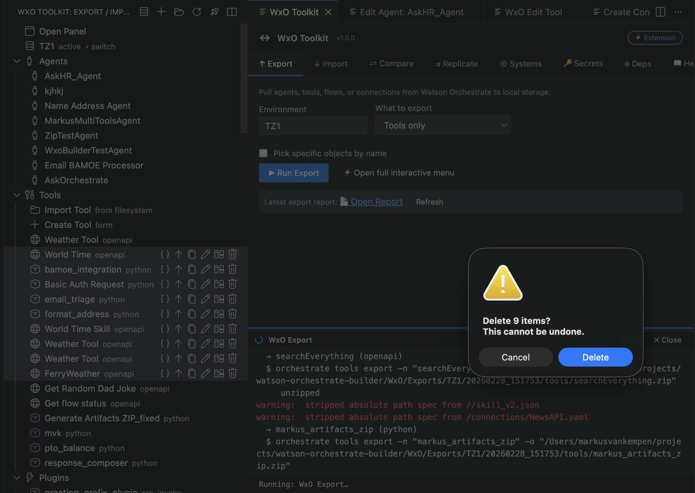
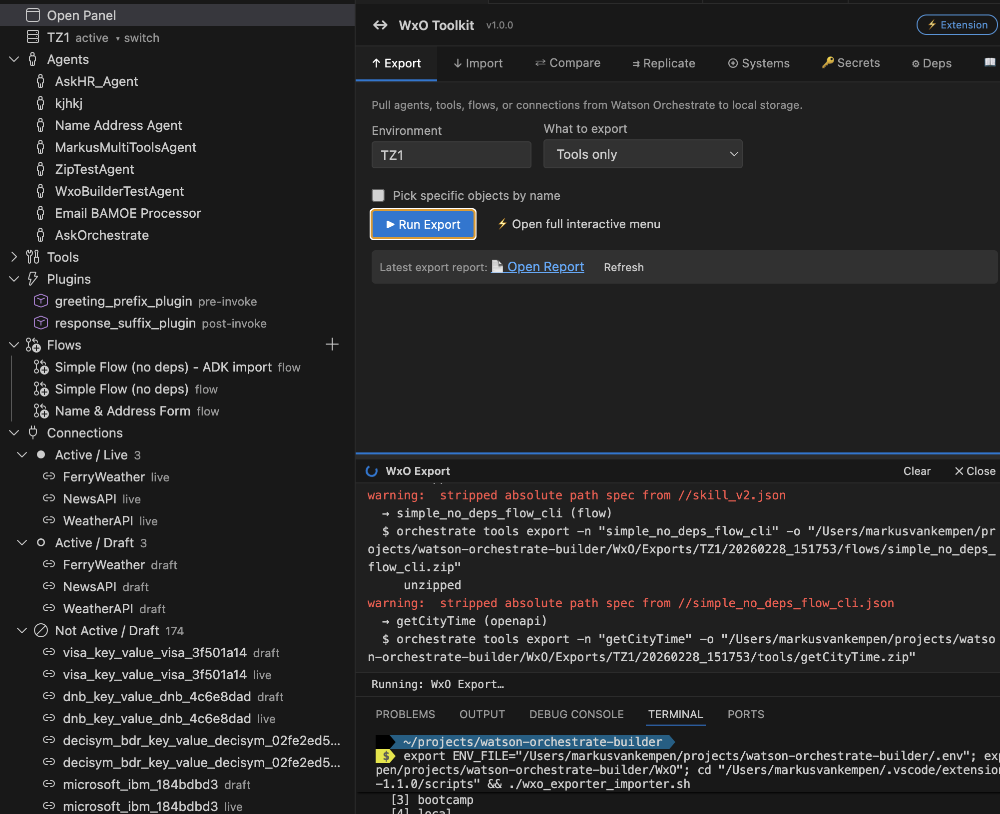
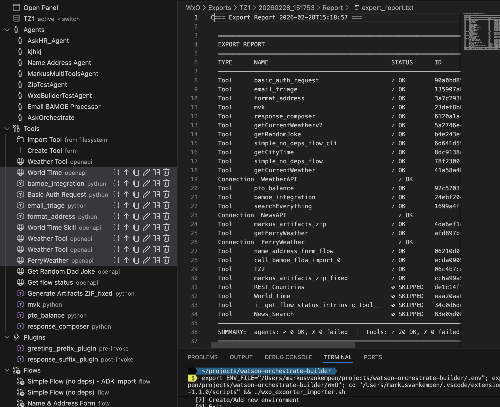
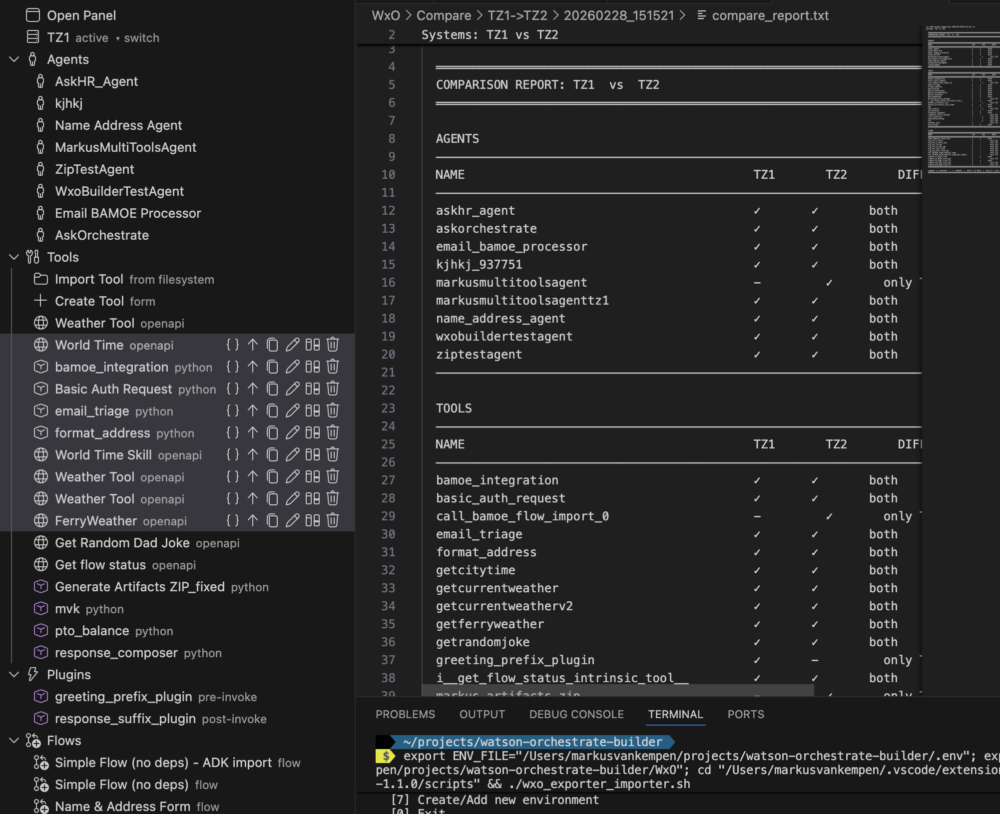
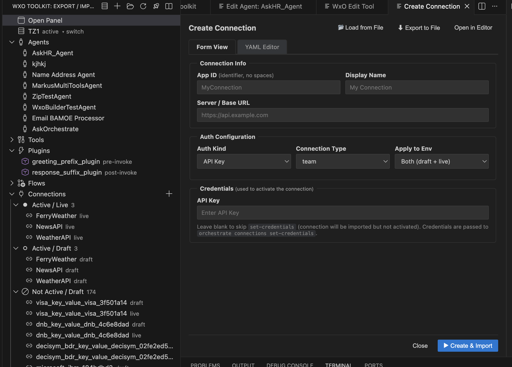

# WxO Toolkit — User Guide

**VS Code Extension** (wxo-toolkit-vsc) · IBM Watsonx Orchestrate

*Author: Markus van Kempen · 28 Feb 2026*

Export, import, compare, replicate, and manage Watson Orchestrate (WxO) agents, tools, flows, and connections directly from VS Code.

---

## Table of Contents

1. [Prerequisites](#prerequisites)
2. [Getting Started](#getting-started)
3. [Activity Bar View](#activity-bar-view)
4. [Resource Actions](#resource-actions)
5. [Main Panel Tabs](#main-panel-tabs)
6. [Settings](#settings)
7. [Troubleshooting](#troubleshooting)

> **New to setup?** See [SETUP.md](SETUP.md) for flow diagrams and a step-by-step credentials guide.

---

## Prerequisites

### Required

- **Watson Orchestrate CLI** — [Install from IBM](https://developer.watson-orchestrate.ibm.com/getting_started/installing)
  ```bash
  pip install --upgrade ibm-watsonx-orchestrate   # ADK 2.5.0+ recommended
  ```
- **jq** — JSON processor (`brew install jq` or `apt-get install jq`)
- **unzip** — for extracting exports (usually preinstalled)

### Python venv

If you install the orchestrate CLI inside a Python virtual environment (e.g. `pip install ibm-watsonx-orchestrate` inside a venv), the extension will not find it by default. Configure the venv path:

1. **Settings** → search `orchestrateVenvPath` or **WxO Toolkit**
2. Set **Orchestrate Venv Path** to your venv folder

| Venv location | Setting value |
|--------------|---------------|
| `.venv` in workspace root | `.venv` |
| `venv` in workspace root | `venv` |
| Absolute path | `/home/me/projects/my-venv` |

The extension prepends `venv/bin` to `PATH` for all CLI operations (Export, Import, Compare, Replicate, Create Tool, Systems). If you don't set this when orchestrate is in a venv, you may see `orchestrate: command not found` or failed dependency checks.

### Environment setup (recommended flow)

**Primary: Use the extension UI**

1. Open **WxO Toolkit** → **Open Panel** → **⊕ Systems** tab
2. Add Environment: Name, URL, API Key (API key is stored securely in VS Code SecretStorage)
3. Click **+ Add Environment**

The extension syncs to the orchestrate CLI and stores credentials. Export, Import, Compare, and Create Tool work immediately.

**Optional: Copy to workspace `.env`**

- Click **📋 Copy to .env** in the Systems tab to write `WXO_API_KEY_<env>` to your workspace `.env`
- Useful for terminal use or sharing with scripts

See [SETUP.md](SETUP.md) for flow diagrams and a detailed setup guide.

---

## Getting Started

1. **Open your workspace** — Open any folder. The extension bundles the wxo-toolkit-cli scripts. Or set `wxo-toolkit-vsc.scriptsPath` to a custom scripts folder.

2. **Select an environment** — In the Activity Bar, click the **WxO Toolkit** icon (↔), then click **Select Environment** or the environment dropdown to choose a Watson Orchestrate instance (TZ1, TZ2, etc.).

3. **Open the panel** — Click **Open Panel** in the tree view, or run **WxO Toolkit: Open Panel** from the Command Palette (`Ctrl+Shift+P` / `Cmd+Shift+P`).

4. **Browse resources** — Expand Agents, Tools, Flows, or Connections in the Activity Bar to see your resources. Use the inline buttons for quick actions.

---

## Activity Bar View



The **WxO Toolkit** section in the Activity Bar shows:

| Item | Description |
|------|-------------|
| **Open Panel** | Opens the main Export/Import/Compare/Replicate panel |
| **Environment name** | Current active environment; click to switch |
| **Agents** | List of agents; inline Create; Edit opens form |
| **Tools** | List of tools (Python, OpenAPI, Flow, etc.); inline Create; Edit opens form |
| **Flows** | List of flow tools; inline Create; Edit opens form |
| **Connections** | Connections; inline Create; Edit opens form with auth options |
| **Plugins** | Agent plugins (pre/post-invoke); Edit opens plugin form |
| **WxO Project Dir** | Tree of Exports, Replicate, Compare, Systems; right-click for New File/Folder, Rename, Delete, Reveal, Copy Path, Open in Terminal |
| **Extension: WxO Toolkit** | Opens this extension (wxo-toolkit-vsc) in the Extensions panel |

**Multi-select** — Shift-click or Ctrl/Cmd-click to select multiple resources; press **Delete** to remove all selected.

### View title bar

- **Select Environment** — Choose a Watson Orchestrate instance
- **Refresh** — Reload the tree
- **Open Panel** — Open the main webview panel

---

## Resource Actions

Each resource (agent, tool, flow, connection) has inline action buttons:

| Icon | Action | Description |
|------|--------|--------------|
| + | **Create** | (Category headers) Create new Agent, Flow, Connection, or Tool via form |
| 📄 | **View JSON** | Opens a read-only view of the resource definition |
| ↑ | **Export** | Export this resource to a local file (zip or yml). Choose output folder. |
| 📋 | **Copy** | Copy to another environment. Choose target, dependencies (agents), and overwrite/rename behavior. |
| ✏️ | **Edit** | Open a form editor (agents, flows, connections, tools) or plugin editor. Form + YAML/JSON tabs; Save pushes via orchestrate CLI. |
| ⇄ | **Compare** | Diff this resource with the same resource in another environment |
| 🗑️ | **Delete** | Remove the resource (with confirmation). Multi-select to delete several at once. For tools/flows/plugins, you can optionally remove from all agent assignments first. |





### Copy options

When you **Copy** a resource:

1. **Target environment** — Select where to copy (e.g. TZ2)
2. **Include dependencies** (agents only) — With or without bundled tools
3. **If exists** — Overwrite, skip, or use new name (`_copy` suffix)
4. **Confirm** — Confirm to run the copy in the terminal

---

## Main Panel Tabs

### ↑ Export



Pull agents, tools, flows, or connections from Watson Orchestrate to local storage (`WxO/Exports/`).

- **Environment** — Source environment (e.g. TZ1)
- **What to export** — All, agents only, tools only, flows only, or connections only
- **Pick specific objects** — (Optional) Select individual agents, tools, or connections by name. Use **Load from env** to populate checkboxes.
- **Run Export** — Executes `export_from_wxo.sh` in a new terminal
- **Latest export report** — Link to open the most recent export report; **Refresh** to rescan



### ↓ Import

Push from a local export folder into a target environment.

- **Export folder** — Pick folder (or path to a previous export)
- **Target environment** — Destination (e.g. TZ2)
- **Import what** — All, agents only, tools only, flows only, or connections only
- **Pick specific objects** — (Optional) Select individual agents, tools, or connections by name
- **If exists** — Override or skip existing resources
- **Run Import** — Executes `import_to_wxo.sh` in a new terminal
- **Latest import report** — Link to open the most recent import report; **Refresh** to rescan

### ⇄ Compare



Compare agents, tools, and flows between two environments. Output saved to `WxO/Compare/`.

- **Source / Target** — The two environments to diff
- **Run Compare** — Executes `compare_wxo_systems.sh`
- **Latest compare report** — Link to open the most recent compare report; **Refresh** to rescan

### ⇉ Replicate

Copy resources from source → Replicate folder → target environment.

- **Source / Target** — Environments
- **What to replicate** — All, agents, tools, or flows
- **Pick specific objects** — (Optional) Select individual agents or tools by name
- **Run Replicate** — Exports to Replicate folder; then run Import from that folder to complete
- **Latest replicate report** — Link to open the most recent replicate report; **Refresh** to rescan

### ✓ Validate

Invoke agents with a test prompt and optionally compare responses with another environment.

- **Agent(s)** — Comma-separated agent names
- **Compare with env** — (Optional) Second environment to test
- **Test prompt** — Prompt to send (e.g. "Hello")
- **Run Validate** — Sends invoke commands to the terminal

### ⊕ Systems

Manage Watson Orchestrate environments registered with the orchestrate CLI.

- **List** — View all environments (name, URL, active status)
- **Activate** — Switch active environment
- **Edit** — Open this environment's connection credentials (`.env_connection_{env}`) in the form editor
- **Remove** — Unregister an environment (does not delete exported data)
- **Add Environment** — Name, URL, auth type, API key (stored securely; synced to orchestrate)
- **Copy to .env** — Write stored credentials to workspace `.env`

### 🔑 Secrets

Edit connection secrets per environment. Stored in `WxO/Systems/{env}/Connections/.env_connection_{env}`.

- **Environment** — Select which system's secrets to edit
- **Key-value table** — Add, edit, or remove `CONN_*` variables
- **Save to file** — Writes changes to disk

### ⚙ Dependencies

Check that required CLI tools are installed and in PATH.

- **Check dependencies** — orchestrate, jq, unzip
- **Install docs** — Open IBM installation documentation

---

## Settings

Configure the extension in **File → Preferences → Settings** (search for "WxO"):

| Setting | Description | Default |
|---------|-------------|---------|
| `wxo-toolkit-vsc.scriptsPath` | Path to wxo-toolkit-cli scripts folder. Leave empty for bundled scripts. | (empty = bundled) |
| `wxo-toolkit-vsc.wxoRoot` | WxO Project Dir: root for Exports, Imports, Compare, Systems | `{workspaceRoot}/WxO` |
| `wxo-toolkit-vsc.orchestrateVenvPath` | Path to Python venv where orchestrate CLI is installed (e.g. `.venv`). Prepend venv/bin to PATH for all CLI calls. | (empty) |
| `wxo-toolkit-vsc.debugPanel` | Write panel HTML to `.vscode/wxo-panel-debug.html` for browser debugging | `false` |

---

## Troubleshooting

### "Scripts not found"

- Open a workspace that contains the wxo-toolkit-cli folder
- Or set `wxo-toolkit-vsc.scriptsPath` to the correct path

### "No active environment"

- Click **Select Environment** in the Activity Bar
- Ensure the orchestrate CLI is installed and `orchestrate env list` shows your environments

### Export/Import commands fail

- Check the terminal output for errors
- If orchestrate is in a Python venv, set `wxo-toolkit-vsc.orchestrateVenvPath` to the venv folder (e.g. `.venv`)
- Otherwise, ensure the orchestrate CLI is in your PATH (or use the full path in settings)
- For import, add the environment with API key in the **Systems** tab, or add `WXO_API_KEY_{ENV}` to `.env`

### API key not found

- Add the environment with API key in the **Systems** tab (recommended; stored securely)
- Or add `WXO_API_KEY_{ENV}` to your workspace `.env` file
- Or run `orchestrate env activate` interactively

### Connection secrets

- Use the **Secrets** tab to manage `CONN_*` variables per environment
- Format: `CONN_<app_id>_<SECRET_NAME>=<value>`
- See `WxO/Systems/{env}/Connections/.env_connection_{env}`

### Panel freezes or JavaScript error

1. Enable debug mode: **Settings** → search `wxo-toolkit-vsc.debugPanel` → check it
2. Open the panel again (e.g. via Activity Bar → Open Panel)
3. The extension writes `.vscode/wxo-panel-debug.html` in your workspace and logs to the **Output** channel (View → Output → select "WxO Toolkit")
4. Open `.vscode/wxo-panel-debug.html` in Chrome or Edge, press **F12** → **Console** tab to see the exact error and line number
5. Share the error message or stack trace when reporting issues

---

## Additional Resources

### Create Tool / Agent / Flow / Connection (Activity Bar)

- **Create Tool** — Python or OpenAPI tools via form. Output to `WxO/Exports/{env}/{datetime}/tools/{name}`.
- **Create Agent / Flow / Connection** — Inline Create buttons; form with YAML/JSON editor; Save imports via orchestrate CLI.



- **Connection form** — Supports API Key, Bearer Token, Basic Auth, OAuth flows; integrates with `orchestrate connections set-credentials` for live connections.
- **Edit** — Opens form (not raw JSON) for agents, flows, connections, tools, plugins. Tools/plugins export to `WxO/Edits/{name}/` for editing.

### WxO Project Dir context menus

Right-click on folders or files:
- **New File / New Folder** — Create items in the WxO directory
- **Rename / Delete** — File operations
- **Reveal in Explorer / Copy Path** — Navigation
- **Open in Terminal** — Open terminal at that path
- **Open / Edit** — `.env_connection_*` files open in the credential form editor

---

## Additional Resources

- **Full CLI User Guide** — `../USER_GUIDE.md` (interactive shell scripts)
- **IBM Watson Orchestrate** — [developer.watson-orchestrate.ibm.com](https://developer.watson-orchestrate.ibm.com)
- **Install orchestrate CLI** — [Getting Started](https://developer.watson-orchestrate.ibm.com/getting_started/installing)
- **Issues** — [GitHub Issues](https://github.com/markusvankempen/wxo-toolkit-vsc/issues)
